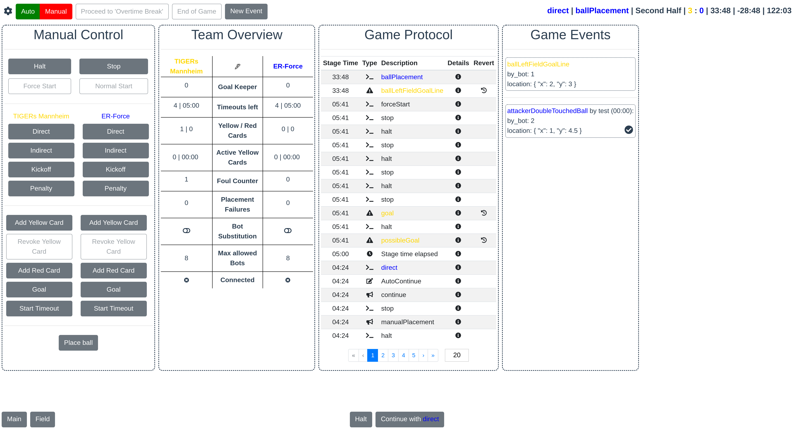

[](https://circleci.com/gh/RoboCup-SSL/ssl-game-controller/tree/master)
[](https://goreportcard.com/report/github.com/RoboCup-SSL/ssl-game-controller)
[](https://godoc.org/github.com/RoboCup-SSL/ssl-game-controller)
[](https://github.com/RoboCup-SSL/ssl-game-controller/releases/latest)
[](https://circleci.com/api/v1.1/project/github/RoboCup-SSL/ssl-game-controller/latest/artifacts/0/coverage?branch=master)

# ssl-game-controller

The [ssl-refbox](https://github.com/RoboCup-SSL/ssl-refbox) replacement that will be introduced at RoboCup 2019.



## Usage
If you just want to use this app, simply download the latest [release binary](https://github.com/RoboCup-SSL/ssl-game-controller/releases/latest). The binary is self-contained. No dependencies are required.

### Runtime Requirements
 * No software dependencies (except for development, see below)
 * 64bit Linux, Windows, OSX (32bit would be possible too, but come on, we are in 2018...)
 * Display Resolution of 1920x1080 is recommended
 * A reasonable Web-Browser (mostly tested on Chrome, please do not try IE...)

### Reference Clients
There are some reference clients:
 * [ssl-ref-client](./cmd/ssl-ref-client): A client that receives referee messages
 * [ssl-auto-ref-client](./cmd/ssl-auto-ref-client/README.md): A client that connects to the controller as an autoRef
 * [ssl-team-client](./cmd/ssl-team-client/README.md): A client that connects to the controller as a team
 
### Comparison to ssl-refbox
The ssl-game-controller replaces the ssl-refbox. With the introduction of automatic referees, there was demand for several new features. To accommodate these, the ssl-refbox has been rewritten to take advantage of modern technologies.

The referee message, that is send to the teams, has no breaking changes. Teams do not need to change their systems. Additional data will be send with the referee messages though. To read those changes, teams can update their `.proto` files from this repository to take advantage of it.

Teams will also have the possibility to connect to a new interface, where they can change their goalkeeper number during Stoppage. Additionally, there will be an advantage rule, where teams can decide to let the game continue on certain fouls.

List of new features:
 * Modern, scalable Web-UI
 * More control of the state (change almost all values)
 * Automatically save and restore state 
 * State history with undo button
 * Includes state that was previously located in all autoRefs
 * New Game Event concept for better interaction with multiple autoRefs
 * Game Log that documents commands and events
 * New interfaces for autoRefs and teams
 * A graphical client can be integrated
 
### FAQ
#### How to start a new game?
* Reset match (button)
* Select team names
* Switch sides, if necessary (button)
* Select division (button switch)
* Set goalkeeper id
* divB: set ball placement capability

#### How to end a game?
Press 'End of Game' button during stop.  
Purpose: Notify team AI about end of game and log it in log files.

#### How to give a goal?
New Event (button) -> Select Goal -> Insert parameters

#### How to correct the current state of a team?
Most of the state can be changed with the edit buttons.
This should only be used in case of misbehavior! Goals, yellow cards, etc. should be given through the respective events ('New event' button)

#### How does the undo button work?
With every interaction in the UI and every new game event from an autoRef, the current state will be copied. The last ~20 states will be saved. Undo rolls the state back to the previous state.  
The state will be persisted with each change. After a crash or restart, the whole history will be restored.

#### How to disable certain game events?
Go to 'Configure Behaviors' (button) and select the game event in the dialog.  
A game event can be set to be:
* Always accepted
* Only accepted when there is a majority between all connected autoRefs
* Ignored (logged as an ignored event in the table)

#### How does the continue button work?
Based on the current game events, the next command will be determined.
This command is sent, when the continue button is pressed.
The next command is also shown in the top right corner.

#### How can I see if my team is connected?
Open connections to teams are shown as an icon next to 'Team Yellow' and 'Team Blue'.
If there is no connection, no icon is shown.

#### How to override/cancel a game event from an autoRef?
All game events that happened since the last running state are listed on the left side with a button to remove this game event again.

#### The controller crashes on start. What can I do?
Try deleting the history.json file in the working directory. It may got corrupted.

## Integration into your own framework
The game-controller can easily be integrated into your own AI framework, if you do not want to implement your own controller for testing purposes.

Download the release binary from the Github release and run it from inside your framework. Then, attach to the WebSocket API that is used by the UI as well. The API is defined in [internal/app/controller/events.go](internal/app/controller/events.go).

An example can be found here: https://github.com/TIGERs-Mannheim/AutoReferee/blob/master/modules/moduli-referee/src/main/java/edu/tigers/sumatra/referee/SslGameControllerProcess.java

## Development

### Requirements
You need to install following dependencies first: 
 * Go >= 1.10
 * NPM

### Prepare
Download and install to [GOPATH](https://github.com/golang/go/wiki/GOPATH):
```bash
go get -u github.com/RoboCup-SSL/ssl-game-controller/...
```
Switch to project root directory
```bash
cd $GOPATH/src/github.com/RoboCup-SSL/ssl-game-controller/
```
Download dependencies for frontend
```bash
npm install
```

### Run
Run the backend:
```bash
go run cmd/ssl-game-controller/main.go
```

Run the UI:
```bash
# compile and hot-reload
npm run serve
```
Or use the provided IntelliJ run configurations.

### Build self-contained release binary
First, build the UI resources
```bash
# compile and minify UI
npm run build
```
Then build the backend with `packr`
```bash
# get packr
go get github.com/gobuffalo/packr/packr
# install the binary
cd cmd/ssl-game-controller
packr install
```
